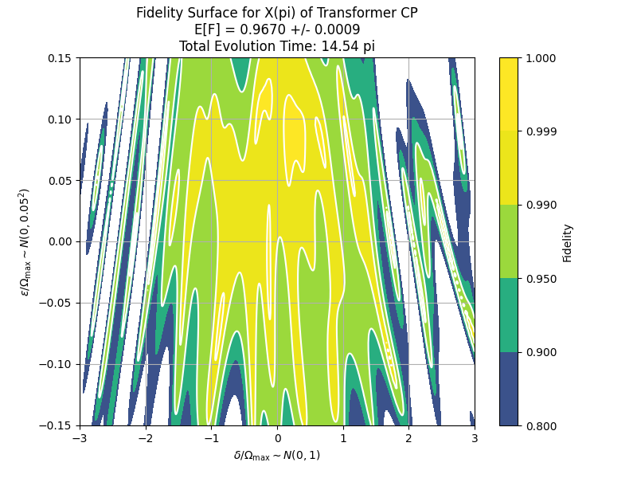

# Robust Quantum Control with Composite Pulse Sequences

This project develops a machine learning framework for generating composite pulse sequences that implement a target quantum operation with high fidelity, even under strong static disorder (e.g., off-resonant errors). It leverages a transformer decoder model to output pulse sequences robust to errors sampled from a given distribution.

---

## 🧠 Objective and Problem Formulation

### Goal

Implement a target quantum unitary $U_{\text{target}}$ using a pulse sequence $[p_1, p_2, ..., p_N] \in \mathcal{P}^N$, where each pulse is robust against a static error $E \sim p(E)$. The primary objective is to optimize composite pulse sequence for a **large** disorder.

### Given:

* Number of qubits $n$
* Target unitary $U_{\text{target}} \in \mathbb{C}^{2^n \times 2^n}$
* Pulse parameter space $\mathcal{P}$
* Static error model $E \sim p(E)$

### Objective:

Maximize expected fidelity:

```math
\mathbb{E}_{E \sim p(E)}\left[ \frac{\left| \text{Tr}(U_{\text{out}}^{\dagger} U_{\text{target}}) \right|^2 + d}{d^2 + d}\right]
```

where 
```math
U_{\text{out}} = U_N \cdots U_1$ and $U_i = \text{unitary\_generator}(p_i, E)
```

A transformer decoder model $f(U_{\text{target}}; \theta)$ is trained to generate the pulse sequence.


### Optimization Code:

The key intuition for this project is to iteratively train the model from low to large disorder. The following is a pseudocode for model training

```{r, eval = FALSE}
train(unitary_generator, error_distribution, U_target):
    theta <- initial model parameter
    for error_param from small to large:
        - for each epoch
            - pulses <- f(U_target; theta) # model output
            - error <- error_distribution(error_param) # error
            - U_out <- unitary_generator(pulses, error)
            - loss_fn <- -log(E[fidelity(U_out, U_target)])
            - theta <- theta - eta * \partial_\theta loss_fn
```

---

## ⚛️ Single Qubit Example with Off-Resonant Error

### Pulse Parameter:

$(\Delta, \Omega, \phi, t) \in \mathcal{P}$

### Base Hamiltonian:

```math
H_{\text{base}} = \Delta \sigma_z + \Omega (\cos\phi \, \sigma_x + \sin\phi \, \sigma_y)
```

### With Error:

```math
H = H_{\text{base}} + \delta \sigma_z, \quad \delta \sim \mathcal{N}(0, \delta_{\text{std}}^2)
```

### Resulting Unitary:

```math
U = \exp(-i H t)
```

---

## 📉 Code Structure

### `model.py`

Defines `CompositePulseTransformerDecoder`, which generates the composite pulse sequence:

```python
class CompositePulseTransformerDecoder:
    def __init__(self, num_qubit, pulse_space, max_pulses): ...
    def forward(self, U_target): ...
```

### `trainer.py`

Handles training via Monte Carlo sampling over error distributions:

```python
class Trainer:
    def __init__(self, model, unitary_generator, error_model, loss_function, monte_carlo_size=1000): ...
    def train(self, unitary_list, error_param): ...
```

### `single_qubit_ore.py`

* Defines `unitary_generator(pulse, error)`
* Defines `p(E; error_param)` as Gaussian
* Computes fidelity between target and output unitary

---

## 🚀 Getting Started

1. Install dependencies:

```bash
pip install torch numpy scipy
```

2. Run training:

```bash
python single_qubit_script_encoder.py
```

---

## 🎯 2D Fidelity Contour Results

The following plots show fidelity contours for different target unitaries under off-resonant error (ORE) and pulse-length error (PLE). Each plot visualizes how robust the learned composite pulse sequence is with respect to variations in error:

<p align="center">
  
  
  <br>
  
  
</p>

Each figure shows the expected fidelity across a grid of error parameters. Brighter regions indicate higher fidelity, demonstrating the robustness of the generated pulse sequences across error distributions.

---


## 📌 Notes

* Supports general $n$-qubit systems
* Pulse space $\mathcal{P}$ can be continuous (e.g., $\Delta, \Omega, \phi, t$)
* Default loss is $-\log \mathbb{E}[F(U_{\text{out}}, U_{\text{target}})]$

---

## 📄 License

MIT License

## ✏️ Citation

If you use this work in academic research or teaching, please cite appropriately.
