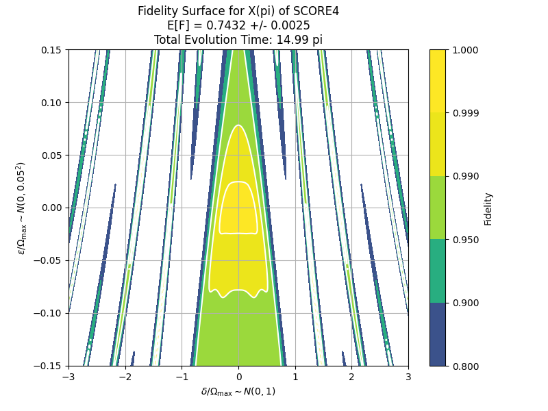
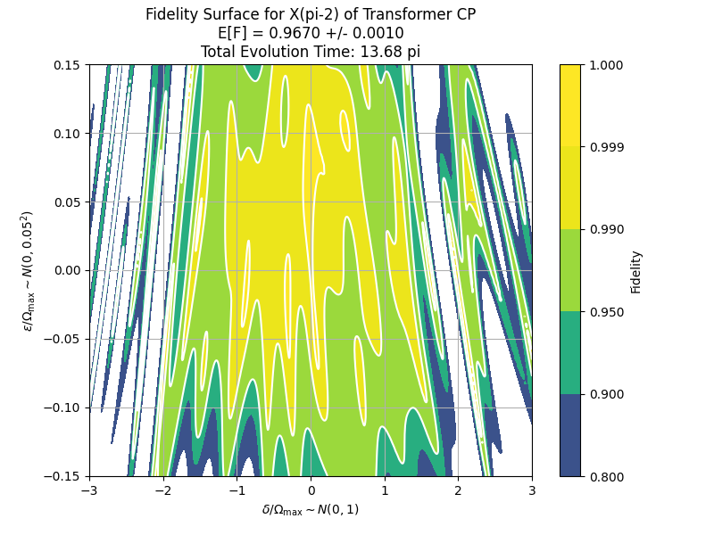
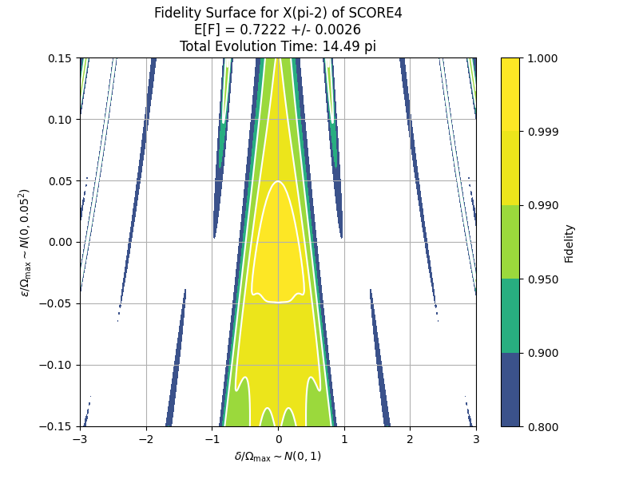
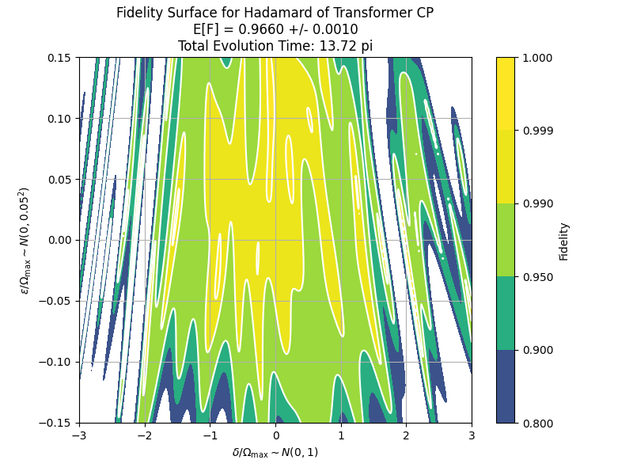
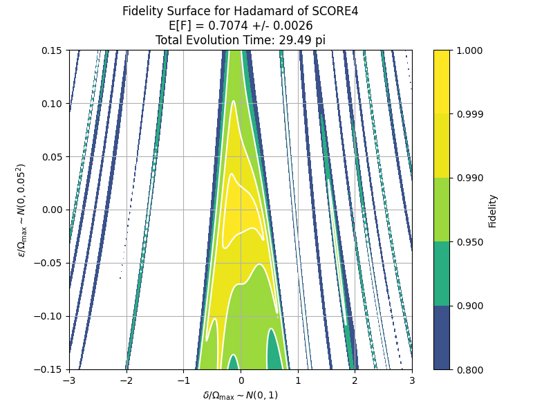
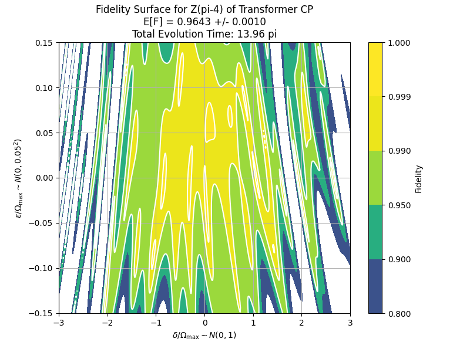
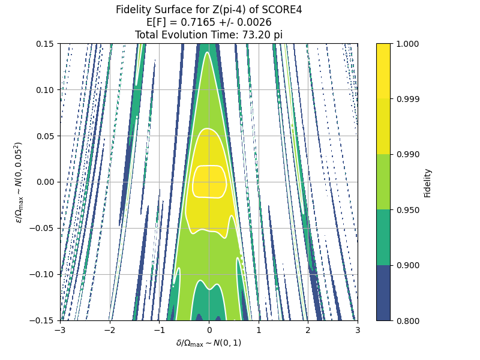

# Robust Quantum Control with Composite Pulse Sequences

This project develops a machine learning framework for generating composite pulse sequences that implement a target quantum operation with high fidelity, even under strong static disorder (e.g., off-resonant errors). It leverages a transformer encoder model to output pulse sequences robust to errors sampled from a given distribution.

---

## 🧠 Objective and Problem Formulation

### Goal

Implement a target quantum unitary $U_{\text{target}}$ using a pulse sequence $[p_1, p_2, ..., p_N] \in \mathcal{P}^N$, where each pulse is robust against a static error $E \sim p(E)$. The primary objective is to optimize composite pulse sequence for a **large** disorder.

### Given:

* Number of qubits $n$
* Target unitary $U_{\text{target}} \in \mathbb{C}^{2^n \times 2^n}$
* Pulse parameter space $\mathcal{P}$
* Static error model $E \sim p(E)$
* Unitary generator $g(p, \epsilon)$ that creates the unitary from pulse $p$ with error $\epsilon$. $p$ is a $(L, P)$ tensor, where $L$ is the total length of composite pulse. 

### Objective:

Maximize expected fidelity:

```math
\mathbb{E}_{E \sim p(E)}\left[ \frac{\left| \text{Tr}(U_{\text{out}}^{\dagger} U_{\text{target}}) \right|^2 + d}{d^2 + d}\right]
```

where 
```math
U_{\text{out}} = U_N \cdots U_1 \text{ and } U_i = \text{unitary\_generator}(p_i, E)
```

A transformer encoder model $f(U_{\text{target}}; \theta)$ is trained to generate the pulse sequence.


### Optimization Code:

The key intuition for this project is to iteratively train the model from low to large disorder. The following is a pseudocode for model training

```{r, eval = FALSE}
train(unitary_generator, error_distribution, U_target):
    theta <- initial model parameter
    for error_param from small to large:
        - for each epoch
            - pulses <- f(U_target; theta) # model output
            - error <- error_distribution(error_param) # error
            - U_out <- unitary_generator(pulses, error)
            - loss_fn <- -log(E[fidelity(U_out, U_target)])
            - theta <- theta - eta * \partial_\theta loss_fn
```

---

## ⚛️ Single Qubit Example with Off-Resonant Error

### Pulse Parameter Space $P$:

```math
P = \{ \Delta \in (-5, 5), \Omega \in (0, 1), \phi \in (-\pi, \pi), \tau \in (0, 0.6)\}
```

### Base Hamiltonian:

```math
H_{\text{base}} = \Delta \sigma_z + \Omega (\cos\phi \, \sigma_x + \sin\phi \, \sigma_y)
```

### High Off-Resonant Error with Small Pulse-Length Error:

Off-Resonant Error (ORE) corresponds to the static error associated to the system disorder. Specifically, it is a unit gaussian such that
```math
\delta \sim N(0, 1)
```
```math
H = H_{\text{base}} + \delta \sigma_z
```
We are assuming the order of magnitude of the ORE is comparable to the maximum Rabi Frequency $\Omega_\max$.

Pulse-Length Error (PLE) corresponds to static error associated to the pulse width. It is a small gaussian such that
```math
\epsilon \sim N(0, 1) \cdot 0.05
```
```math
\tau \rightarrow \tau \cdot (1 + \epsilon)
```
We are assuming that we are working with high-performance pulse devices such that the magnitude of PLE is roughly 5% of $\Omega_\max$.

### Resulting Unitary:

```math
U = \exp(-i H \tau)
```


---


## 📁 Codebase Structure

This repository is organized into the following key directories:

### `model/`

Contains the core machine learning logic for composite pulse sequence generation:

* `model_encoder.py`: Defines the Transformer-based model architecture for generating pulse sequences.
* `trainer.py`: Implements the training loop and optimization logic for model learning.

### `weights/`

Stores pretrained model weights and the optimized pulse sequences:

* Use these files for direct inference without retraining.
* Includes checkpoints and sample pulse outputs.

### `train/`

Contains training scripts tailored to specific quantum systems:

* `single_qubit/`: Scripts for training on single-qubit target unitaries.
* `two_qubit/`: Scripts for training on two-qubit operations (e.g., entangling gates).

You can configure the model and training settings via the `model_params.json` file in each subfolder.

### `visualize/`

Includes visualization utilities:

* Use these scripts to plot and analyze the learned composite pulse sequences.
* Helpful for inspecting fidelity contours, pulse robustness, and system behavior under error.

---

To get started, run a training script under `train/`, or load a pretrained model from `weights/` and use the visualization tools to analyze performance.


## 🚀 Getting Started

1. Install dependencies:

```bash
pip install torch numpy scipy
```

2. Run training:

```bash
python train/single_qubit/single_qubit_script_encoder.py
```

---

## 📊 Fidelity vs ORE Standard Deviation

The following table shows the average fidelity and standard error for each target unitary under varying off-resonant error (ORE) standard deviation. PLE error `epsilon_std` was set at 0.05.

| ORE Std (δ) | X(π)           | X(π−2)         | Hadamard       | Z(π−4)         |
|-------------|----------------|----------------|----------------|----------------|
| 0.1         | 0.9923 ± 0.0001 | 0.9950 ± 0.0001 | 0.9938 ± 0.0001 | 0.9931 ± 0.0001 |
| 0.2         | 0.9930 ± 0.0001 | 0.9942 ± 0.0001 | 0.9937 ± 0.0001 | 0.9925 ± 0.0001 |
| 0.3         | 0.9926 ± 0.0001 | 0.9938 ± 0.0001 | 0.9931 ± 0.0001 | 0.9925 ± 0.0001 |
| 0.4         | 0.9917 ± 0.0001 | 0.9929 ± 0.0001 | 0.9923 ± 0.0001 | 0.9918 ± 0.0001 |
| 0.5         | 0.9909 ± 0.0002 | 0.9919 ± 0.0002 | 0.9909 ± 0.0002 | 0.9910 ± 0.0002 |


---

## 🎯 2D Fidelity Contour Results: Transformer vs SCORE

The following plots show fidelity contours for different target unitaries under off-resonant error (ORE) and pulse-length error (PLE). Each pair of plots compares the robustness of the composite pulse sequences generated by the transformer encoder (left) and the SCORE baseline (right). Brighter regions indicate higher fidelity, highlighting robustness across a range of error values.

<p align="center">
  
  
  
  
  <br>
  
  
  
  
</p>


---


## 📌 Notes

* Supports general $n$-qubit systems
* Pulse space $\mathcal{P}$ can be continuous (e.g., $\Delta, \Omega, \phi, t$)
* Default loss is $-\log \mathbb{E}[F(U_{\text{out}}, U_{\text{target}})]$

---

## 📄 License

MIT License

## ✏️ Citation

If you use this work in academic research or teaching, please cite appropriately.
